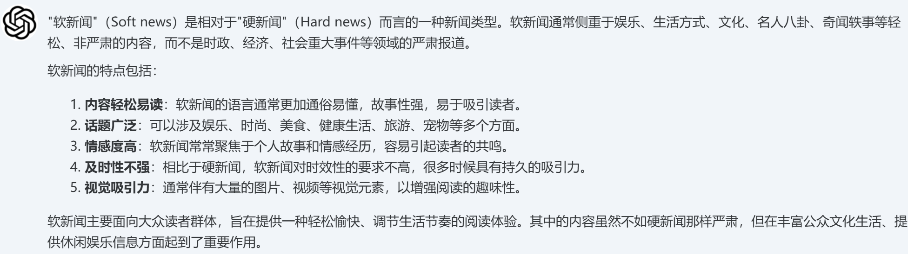
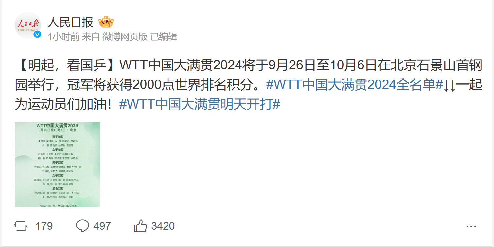

# 08-软新闻

#### *202213093013*

#### *22数科付金媛*

#### *2024.9.25*

## 一、名词定义

-   **来自软媒体的传播被称为软新闻**，而如果新闻内容严肃，则为硬新闻。
    -   软媒体（Soft media）分发的内容以评论、娱乐、艺术和生活方式为主。软媒体可以以电视节目、杂志或印刷文章的形式传播到各地。
-   **软新闻被定义为以娱乐或实用资讯为主的新闻**。新闻的软硬经常被比较，约翰扎勒将后者定义为"涉及国家领袖、重大事件或问题，亦或特大刑事案件或自然灾害"。虽然二者皆旨在为受众提供资讯，但两者包含的内容和传播方法亦不一致。**通过软媒体形式传播的软新闻通常包含在娱乐节目或娱乐资讯报刊**。

> 定义来源：维基百科。 [点击此处跳转](https://zh.wikipedia.org/wiki/%E8%BD%AF%E5%AA%92%E4%BD%93) 维基百科对软媒体的定义。

-   补充：**问答式**检索

> 此处有一张照片，如未显示，请看代码 我第一次预览是没有图像的但是第二次预览能够成功显示，特补此说明。

-   文献研究中的定义

    -   软新闻(soft news)即时间性不强的新闻,与时间性很强的"易碎新闻"即硬新闻(hard news)相对。软新闻基本包括软消息(brief soft news)和特写(features),也可以囊括许多独具特色的新闻文体,如:新闻素描、评述性消息、经验性消息、综合消息、人物、典型报道和通讯等。

    -   软新闻文体自由不必采用传统的倒金字塔形式。它结构复杂,注重引发读者兴趣,唤起受众的愉悦或者深思的情感,强调人类兴趣,具有雄厚的美学基础。

    -   从传播学的角度,它的传播效果比硬新闻好。目前,迫于竞争,**硬新闻也有软化的趋势**。硬新闻软化的方法大致有:软标题(强调趣味性)软导语,即以形象写激发兴趣和悬念,如吴潜龙归纳的6种英美流行导语写法概括性导语、叙述性导语、对照性导语、短促性导语、直接对话导语、引导性导语等等,软背景(提供风俗、宗教、文化历史方面的背景知识以增进理解)软角度切入(不从正面切入事件)、软语言,等等。正是由于软新闻时间性不强,而且照样可以以自由的形式报道重大题材,记者们得以以时间换取效果,可以深思熟虑,细心剪裁,从历史文化等多角度反思现实事件,用背景材料充实内容,争取到了足够的时间遣词造句,采取多样化的写作手法,吸取小说、杂文的技巧,融入记者的个性特征和文体风格,加入记者对事态的综合归纳和建设性的意见以及对国际局势未来的预见。

> 引用自：潘家云. 软新闻的语言变异探析[J]. 外语与外语教学,2005(6):58-60.

-   自己的话总结：

    -   娱乐平台等较轻松的媒体传播的新闻为软新闻。
    -   风格较灵活自由，不像官方新闻一样严肃。
    -   软新闻和硬新闻是一对概念，常常一起讨论。

## 二、背景和上下文

### 1. 名词发展背景

-   软新闻 Sofinews在国外又被称作大众新闻 Massnews它兴起于上世纪20-30年代的美国,是伴随着新闻事业由早期商业报刊向大众化报业的发展而兴盛的一种新闻报道风格。商业报刊在当时属于上层报纸,是工业革命过程中出现较早的报刊。它代表资产阶级利益,政治经济上独立:业务上提倡客观报道,提供硬新闻:读者对象主要是政界、工商界或知识界人士。

-   大众化报业是以廉价报纸的方式出现的。工业革命后期,各国先后出现了面向社会中下层的通俗报刊,因售价较低,通常称为廉价报纸,又因读者均为平民大众,也称为大众化报纸。内容上注重地方新闻、社会新闻等软新闻:形式上文字通俗,版面活泼,可读性强:经营上完全商业化,大量刊登广告,以此来降低售价,扩大发行。

-   廉价报纸的出现使商业报纸更加兴盛，逐步成为资产阶级报业的主体,并为其向现代报业演变奠定了基础。比如纽约的(太阳报》,美国第一份成功的廉价报纸，其特点为坚持低价发行,内容主要是软新闻:地方新闻、社会新闻等重视广告收入,为美国开商业小报的先河。还有纽约(先驱报》:1835年5月6日发刊。热衷于耸人听闻的题材,报道内容更加广泛,更重视全方位的新闻报道,注意全国性信息和国际新闻,首创金融新闻栏与社交新闻,率先提供体育新闻,1924年与(论坛报》合并为《纽约先驱论坛报》。

> 内容来自：梁爽. 软新闻的由来及发展趋势[J]. 新闻传播,2009(6):42-43.

-   一句话个人总结：
    -   软新闻本身是软媒体的衍生词汇，随着时间的推移，软硬的界限逐渐模糊，软新闻也可以传达公共机关的政治倾向等。不仅停留在娱乐的层面，而是逐渐演化为借助娱乐的形式，将想传达的价值观在不经意中传达给民众。

### 2. 词语使用领域

**适用领域概述**：政治、经济、社会、文化、财经、艺术等多方面全领域适用。

在2004年美国总统选举期间，很多娱乐和生活风格杂志（如时尚、女士家杂志和奥普拉杂志）开始涉足政治领域。这说明美国各媒体正在成为政策和政治信息的提供者。

### 3. 为什么重要

举例来讲，美国人平均每天电视收视时间超过五个小时。在此期间，他们提供硬新闻直接或通过软新闻间接关注政治、外交和政策的新闻和资讯。这些主题穿插在黄金时段的各种节目之中，尤其是在国家爆发政治危机之时。研究表明，在这种情况下报道的新闻会吸引与政治保持距离的人开始关注相关事宜。总体而言，更多的人习惯收视硬新闻。但是，与政治参与度高的人相比，那些政治参与度较低的人可以从软新闻中获得更多信息。

随着时代发展，信息越来越碎片化，软新闻的影响力逐渐升高，自媒体平台或者娱乐小报等媒体机构在公众尤其是青年群体中的影响力逐步升高。软新闻的影响力也在逐步升高。

> 来源于：维基百科，跳转链接同上。

### 4. 个人总结：

政府应当把握住软新闻的政治情感倾向和传达内容核心价值观，因为其会在潜移默化中带给公众一种情感倾向。软新闻也是新闻的一种，其本身就具有新闻的一切职能。不能因为其附带的娱乐化属性而被其麻痹，忽视了对软新闻内部情感特征的管控。软新闻虽然套了层轻松的外皮，但是仍应该按照新闻的态度严格的审视其背后的舆情导向。

## 三、举例说明

> 此处有三张照片，如未显示，请看代码 我第一次预览是没有图像的但是第二次预览能够成功显示，特补此说明。

软新闻的常见形式包括官媒的娱乐化新闻报道、非主流媒体的报道、明星八卦娱乐、自媒体营销号等多种内容形式，上图所示为较常见的三种例子~

## 四、对比分析

| 比较维度 |                             软新闻                             |                    硬新闻                    |                         软媒体                         |                       软文                       |
|:--------:|:--------------------------------------------------------------:|:--------------------------------------------:|:------------------------------------------------------:|:------------------------------------------------:|
|   特点   | 内容轻松，关注名人、时尚、美食、旅游等，通常不涉及重大社会问题 | 内容严肃，关注政治、经济、社会问题等重大事件 |        内容多样，包括娱乐、生活、文化等轻松话题        | 看似普通文章，实则为营销内容，不直接提及广告意图 |
|   形式   |                            新闻报道                            |                   新闻报道                   |           媒体平台，如杂志、网站、社交媒体等           |            文章、博客、社交媒体帖子等            |
| 应用目的 |            提供信息和娱乐，满足人们对轻松话题的兴趣            |          传递重要信息，影响公众意见          |           提供轻松愉快的内容，吸引读者或观众           |     推广产品、服务或品牌，潜移默化地影响读者     |
| 相似之处 |            与软文一样，都可能包含情感或故事性的元素            |     与软新闻一样，都是新闻报道的一种形式     |       与软新闻一样，都倾向于使用轻松、有趣的内容       |    与软新闻一样，都可能包含情感或故事性的元素    |
| 主要区别 |                与软文不同，软新闻不具有营销目的                | 内容和目的与软新闻不同，硬新闻更关注重大事件 | 软媒体是一个更广泛的范畴，包括软新闻，但不限于新闻报道 |         软文具有营销目的，而软新闻则没有         |

: 名词概念对比表

## 五、深入扩展

感觉不是很复杂，很好理解，在此处不再赘述\~

## 六、简明总结

软新闻是一种以**轻松、娱乐和实用性**为主要特点的新闻形式，它通常涉及名人、时尚、美食、旅游等轻松话题，并通过电视节目、杂志、印刷文章等软媒体渠道进行传播。与严肃的硬新闻相比，软新闻更注重引发读者的兴趣和情感共鸣，其结构和形式也更加灵活多样。起源于20世纪20-30年代的美国，软新闻随着大众化报业的发展而兴盛，如今在现代社会中，尤其是在青年群体中的影响力越来越大。**软新闻不仅能够提供信息和娱乐，满足人们对轻松话题的兴趣，还可能在潜移默化中传达某种政治倾向或价值观**，因此，它在新闻传播领域中扮演着重要的角色。

## 七、参考文献

[1] Sex, Lies, and War: How Soft News Brings Foreign Policy to the Inattentive Public, Matthew A. Baum

[2] Zaller, John. A New Standard of News Quality: Burglar Alarms for the Monitorial Citizen. Political Communication. 2003, 20 (2): 109--130.

[3] Soft News Goes to War: Public Opinion and American Foreign Policy in the New Media Age, Matthew A. Baum

[4] 林进春. 论"软新闻"和"硬新闻"的内涵[J]. 新闻传播,2017(6):39,41.

[5] 黄敬文. 软新闻的拍摄[J]. 中国记者,2006(6):67-69.
