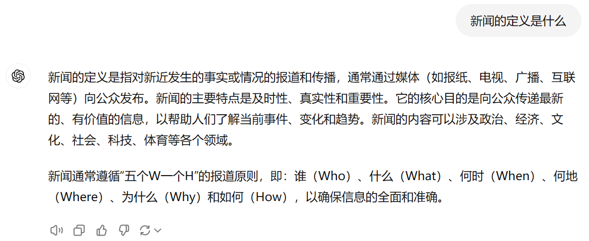

> 姓名: 曾江林
> 
> 学号: 2021219143019

# 新闻

## 内容

### 定义

以下 [内容](https://zh.wikipedia.org/wiki/新闻) 来自`维基百科`

> 新闻在中国古代又称新文，近代有时泛指报纸，在日语及韩语汉字中则只有报纸一义。通常指新闻机构发布的最近发生事件的消息报道。

以下 [内容](https://baike.baidu.com/item/新闻/289002) 来自`百度百科`

> 新闻，也叫消息、资讯，是通过报纸、电台、广播、电视台等媒体途径所传播信息的一种称谓。是记录社会、传播信息、反映时代的一种文体。

以下 [内容](https://chatgpt.com) 来自`ChatGPT-4o`

> 新闻是指对新近发生的事实或情况的报道和传播

综上所述，可以归纳得到新闻的定义: **新闻是新闻机构发布的新近发生事件的报道和传播**

### 背景

新闻的概念在不同时代和不同文化背景下有着不同的理解和表达方式。早在中国古代，新闻就被称为“新文”，这一词汇体现了其与时俱进的特点。在古代，信息的传播渠道较为有限，主要通过书信、口头传播等方式进行。随着近代印刷技术的发展和大众传媒的出现，报纸、广播等逐渐成为人们获取新闻的主要途径。现代社会，由于互联网和数字技术的普及，新闻的传播速度大大提高，新闻的形式也更加多样化，涵盖了文本、图片、视频、音频等多种表现形式。

在今天的媒体环境中，新闻不仅仅是对事件的简单报道，它更是一种重要的社会功能。新闻的传播可以帮助公众了解世界，形成社会共识，同时也是社会监督的重要手段。新闻的真实性、公正性和时效性被认为是其核心价值所在。

### 举例说明

- 🚨 **突发事件报道**：在某城市发生重大自然灾害（如地震、台风）时，新闻机构会迅速发布相关信息，如受灾情况、救援进展等，帮助公众了解事态发展，提供必要的应急措施和安全提示。
- 🎤 **政治新闻**：新闻机构报道关于国家领导人的重要讲话、外交活动或政策变化，向公众传达国家的政治动向及其潜在影响。
- 📈 **经济新闻**：例如，一家公司发布季度财报，新闻机构会对其进行解读，分析业绩表现及其对股票市场的影响，帮助投资者做出决策。
- 👥 **社会新闻**：关于某个社会问题的深度报道，如环境污染、贫富差距等，新闻报道可以引发社会广泛关注和讨论，推动政策的改进和实施

### 对比分析

横向对比`新闻`、`广告`、`娱乐内容`的特点

| 特点/形式 | 新闻 📰    | 广告 📈      | 娱乐内容 🎭    |
|-------|----------|------------|------------|
| 目的    | 传递事实和信息  | 推广产品或服务    | 提供娱乐和放松    |
| 真实性   | 高，追求客观报道 | 可能夸大，不完全真实 | 虚构，艺术创作    |
| 时效性   | 强，报道最新事件 | 可长可短，不强调时效 | 不一定，有时效性节目 |
| 公共性   | 高，关注公共利益 | 低，关注商业利益   | 一般，个人娱乐为主  |
| 内容选择  | 基于新闻价值   | 基于市场策略     | 基于受众兴趣     |

这个表格突出了新闻、广告和娱乐内容在目的、真实性、时效性、公共性和内容选择方面的主要差异。

### 深入扩展

在新闻的实际运作中，新闻报道并非完全中立或无偏见。新闻选择、报道角度、用词等方面都可能反映新闻机构的立场或偏好。因此，新闻媒体的多样化和竞争有助于确保信息的全面性和多元性。近年来，新闻行业面临着许多挑战，包括假新闻的传播、算法推荐对新闻多样性的影响，以及新闻商业模式的转型等。这些问题不仅影响了新闻的真实性和公信力，也引发了对新闻伦理和社会责任的讨论。

### 简明总结

新闻是指由新闻机构发布的新近发生事件的报道和传播。它在社会中起着重要的作用，能够记录社会变迁、传播重要信息、反映时代特点。随着传播技术的进步和媒体环境的变化，新闻的形式和功能也在不断演变，但其核心价值始终在于提供真实、及时和具有公共意义的信息。

## 参考链接

- [维基百科](https://zh.wikipedia.org/wiki/新闻)
- [百度百科](https://baike.baidu.com/item/新闻/289002)
- [ChatGPT](https://chatgpt.com)

